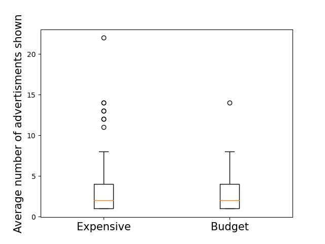
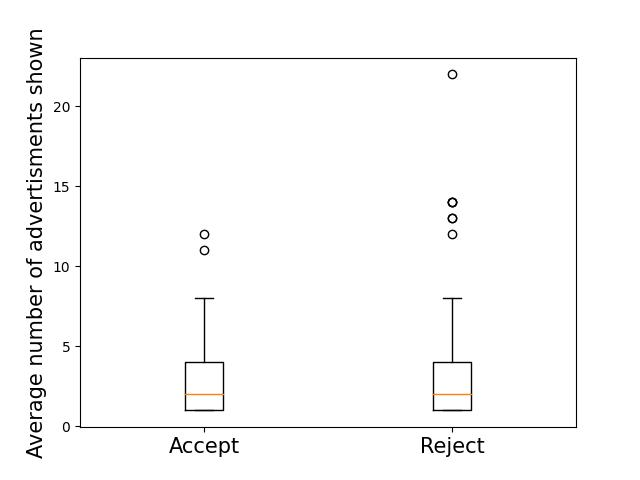
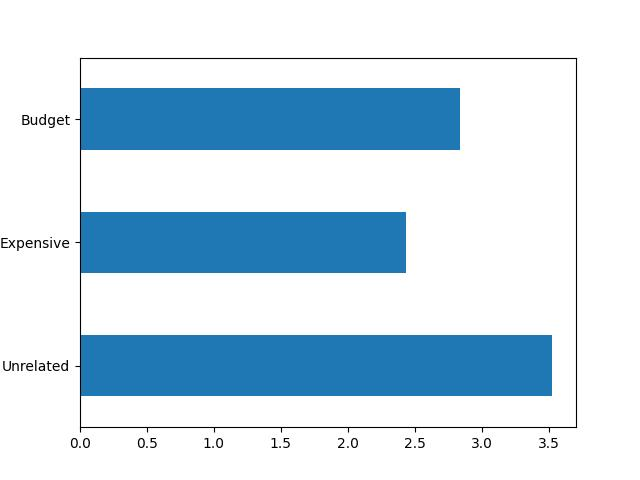
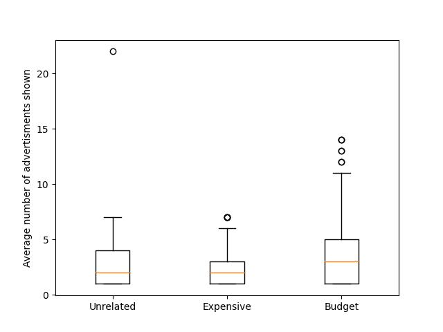

# Collection and Analysis of Search Advertisements

This project aims to characterize the search advertisements which appear on the Google search results based on previous behavior of users. 

The idea is to mimic the behaviors of different kinds of search engine users and analyze the search results, specifically advertisements, they encounter for the same queries. 

This project was inspired by existing academic research about filter bubble, but then evolved to be focused on advertisements. 

## Findings

## THE METHODOLOGY
- Crawl shopping websites that are either discounters or regular/expensive websites
- Crawl with or without clicking “I accept”
- Crawl with different web browsers to see whether it makes a difference
- Do Google searches and collect the advertisements together with all the information from above

### The Experiment
- 766 searches conducted with 766 users, each having their own browser history
- A total of 2293 advertisements shown as a result of these searches in the first page on Google
- An average of 2.99 ads are shown for each search

### User Background Analysis: Browser History

- An average of 2.78 ads are shown in a single google search of a user who has been to discounter websites, while an average of 3.07 are shown to a - user who has been to more expensive shopping sites
- Using the Mann-Whitney rank test, we reject the null hypothesis that the both groups receive the same amount of ads, with the alternative expensive budget

### User Background Analysis: Cookie Consent

- On average, a user who consents to cookies sees 3.06 search advertisements while a user who clicks reject sees 2.96.
- Mann-Whitney rank test fails to reject the hypothesis that there is no difference between groups
- We find no evidence that cookie consent matters

### Search Queries

- Taking into account the type of search a user is making, we fail to reject that the search query type makes a difference in the amount of advertisements using the Kruskal-Wallis H-test
